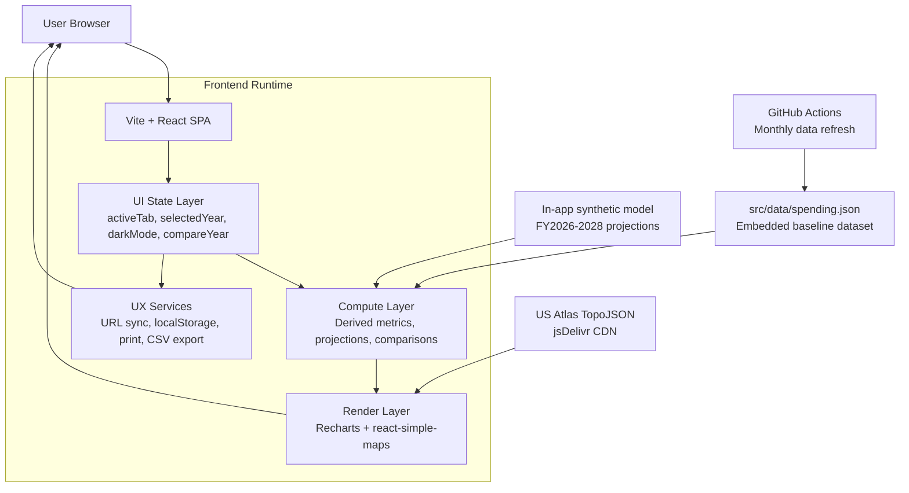

# Federal Spending Analytics Dashboard

A comprehensive, interactive dashboard for visualizing U.S. federal spending data from FY2019-2028. Built as a portfolio piece demonstrating full-stack development, data visualization, and modern web practices.

**[Live Demo →](https://nmahjan.github.io/federal-spending-dashboard)**


## Features

### 📊 Data Visualization
- **9 Interactive Tabs**: Overview, Revenue, Budget, Debt, Workforce, Contracts, Agencies, States, Projections
- **Multiple Chart Types**: Line charts, bar charts, pie charts, area charts via Recharts
- **Interactive US Map**: State-level spending visualization with hover tooltips
- **Responsive Design**: Optimized for desktop, tablet, and mobile

### 🔮 Projections & Analysis
- **3-Year Forecast**: FY2026-2028 projections based on CBO estimates
- **Historical Trends**: 7+ years of spending data (FY2019-2025)
- **Key Metrics**: Debt-to-GDP ratio, deficit tracking, workforce trends
- **DOGE Impact**: Tracks 2025 workforce reduction and recovery projections

### 🤖 AI Chatbot
- **Natural Language Q&A**: Ask questions about federal spending data
- **Year-Aware Responses**: Mention any year (2019-2028) to get specific data
- **Topic Coverage**: Spending, revenue, debt, agencies, workforce, Medicare, defense, and more

### ⚡ User Experience
- **Dark Mode**: Toggle between light and dark themes (persists via localStorage)
- **URL Parameters**: Share specific views with `?tab=debt&year=2024`
- **CSV Export**: Download data from Agencies, States, and Contracts tabs
- **Print Friendly**: Optimized print stylesheet for reports/PDFs

## Tech Stack

| Layer | Technologies |
|-------|-------------|
| **Frontend** | React 19, Vite 7, Tailwind CSS v4 |
| **Charts** | Recharts, react-simple-maps |
| **Hosting** | GitHub Pages (static deployment) |
| **CI/CD** | GitHub Actions (monthly data updates) |

## System Diagram



### What this means

- **No backend server at runtime:** the dashboard is a static SPA hosted on GitHub Pages.
- **Primary data path:** local JSON + computed projection logic feed all tabs/charts.
- **External API dependency:** map geometry is fetched from jsDelivr (`us-atlas@3/states-10m.json`).
- **Browser API layer:** URL query params (`URLSearchParams`), theme persistence (`localStorage`), print (`window.print`), and CSV downloads (`Blob` + object URL).

## Quick Start

### Prerequisites
- Node.js 18+ and npm

### Installation
```bash
# Clone the repository
git clone https://github.com/nmahjan/federal-spending-dashboard.git
cd federal-spending-dashboard

# Install dependencies
cd frontend
npm install

# Start development server
npm run dev
```

Open [http://localhost:5173/federal-spending-dashboard/](http://localhost:5173/federal-spending-dashboard/)

### Production Build
```bash
npm run build
npm run preview  # Test production build locally
```

## Project Structure

```
us-financial-tracker/
├── frontend/
│   ├── src/
│   │   ├── App.jsx          # Main application (2600+ lines)
│   │   ├── index.css         # Tailwind + dark mode + print styles
│   │   └── main.jsx          # React entry point
│   ├── public/
│   │   └── data/             # Static JSON data files
│   ├── index.html
│   ├── vite.config.js
│   └── package.json
├── .github/
│   └── workflows/
│       └── update-data.yml   # Monthly data update automation
└── README.md
```

## Data Sources

All data is embedded in the application for static hosting:

- **Spending Data**: Modeled after [USAspending.gov](https://usaspending.gov)
- **Debt & GDP**: Based on [Treasury Department](https://fiscaldata.treasury.gov) data
- **Projections**: Derived from [CBO Budget Outlook](https://cbo.gov)

### Fiscal Year Coverage
| Type | Years |
|------|-------|
| Historical | FY2019-2025 |
| Current | FY2026 |
| Projected | FY2027-2028 |

## URL Parameters

Share specific dashboard views:

| Parameter | Values | Example |
|-----------|--------|---------|
| `tab` | overview, revenue, budget, debt, workforce, contracts, agencies, states, projections | `?tab=debt` |
| `year` | 2019-2026 | `?year=2020` |

**Examples:**
- `?tab=debt&year=2024` - Debt tab for FY2024
- `?tab=projections` - Projections tab
- `?tab=agencies&year=2021` - Agencies during COVID spending

## Features Roadmap

- [x] CSV data export
- [x] Dark mode toggle
- [x] URL parameters for sharing
- [x] Print stylesheet
- [x] Projections tab (FY2026-2028)
- [x] AI chatbot with year detection
- [x] Year comparison mode
- [x] Loading skeletons
- [x] Accessibility (ARIA labels, keyboard nav)
- [x] Unit tests (Vitest)

## Contributing

1. Fork the repository
2. Create a feature branch (`git checkout -b feature/amazing-feature`)
3. Commit changes (`git commit -m 'Add amazing feature'`)
4. Push to branch (`git push origin feature/amazing-feature`)
5. Open a Pull Request

## License

This project is open source and available under the [MIT License](LICENSE).

## Author

**Neil Mahajan** - [GitHub](https://github.com/nmahjan) | [Portfolio](https://nmahjan.github.io)

---

*Built with ☕ and data transparency in mind*
